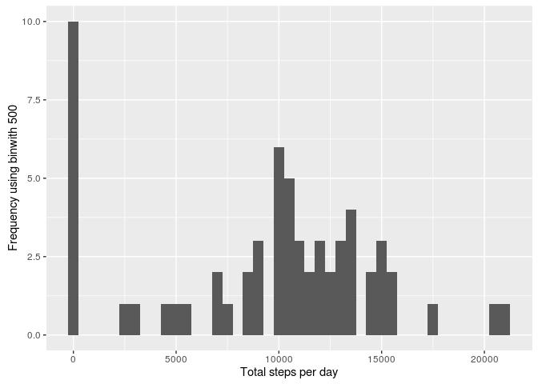
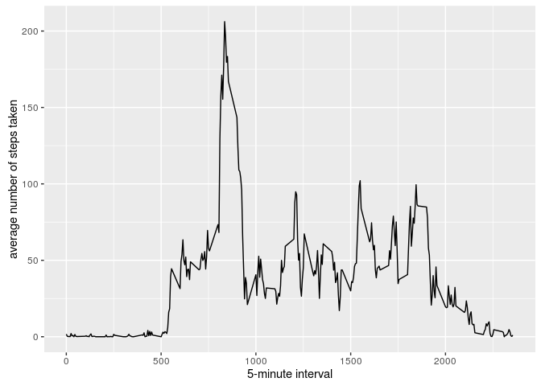
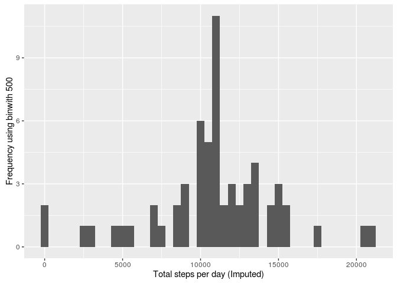
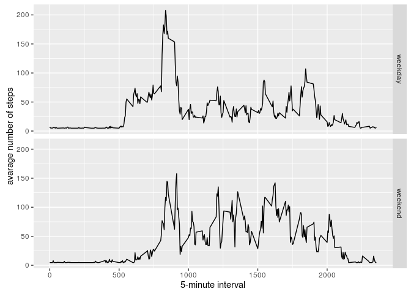

# Reproducible Research Assignement 1 
___

```r
library(ggplot2)
library(Hmisc)
```

```
## Loading required package: lattice
```

```
## Loading required package: survival
```

```
## Loading required package: splines
```

```
## Loading required package: Formula
```

```
## 
## Attaching package: 'Hmisc'
```

```
## The following objects are masked from 'package:base':
## 
##     format.pval, round.POSIXt, trunc.POSIXt, units
```
###Loading and preprocessing the data  
**1.Load the data (i.e. read.csv())**  

```r
unzip('activity.zip')
dat<-read.csv("activity.csv")
```
  
###What is mean total number of steps taken per day?  
**1.Calculate the total number of steps taken per day** 

```r
no_of_steps<-tapply(dat$steps, dat$date, sum, na.rm=TRUE)
```
  
**2.Make a histogram of the total number of steps taken each day** 

```r
qplot(no_of_steps, xlab='Total steps per day', ylab='Frequency using binwith 500', binwidth=500)
```

<!-- -->
    
**3.Calculate and report the mean and median total number of steps taken per day**

```r
stepsByDayMean <- mean(no_of_steps)
stepsByDayMedian <- median(no_of_steps)
cat("Mean:",stepsByDayMean)
```

```
## Mean: 9354.23
```

```r
cat("Median:",stepsByDayMean)
```

```
## Median: 9354.23
```
  
  
###What is the average daily activity pattern?  
  
**1.Make a time series plot**

```r
averageStepsPerTimeBlock <- aggregate(x=list(meanSteps=dat$steps),by=list(interval=dat$interval), FUN=mean, na.rm=TRUE)
ggplot(data=averageStepsPerTimeBlock, aes(x=interval, y=meanSteps)) +geom_line() +xlab("5-minute interval") +ylab("average number of steps taken") 
```

<!-- -->
  
**2.Which 5-minute interval, on average across all the days in the dataset, contains the maximum number of steps?**

```r
mostSteps <- which.max(averageStepsPerTimeBlock$meanSteps)
timeMostSteps <-  gsub("([0-9]{1,2})([0-9]{2})", "\\1:\\2",averageStepsPerTimeBlock[mostSteps,'interval'])
cat("The Interval is:",timeMostSteps)
```

```
## The Interval is: 8:35
```
  
###Imputing missing values
  
**1.Calculate and report the total number of missing values in the dataset**

```r
missVal <- length(which(is.na(dat$steps)))
cat("Number of missing values:",missVal)
```

```
## Number of missing values: 2304
```
  
**2.Devise a strategy for filling in all of the missing values in the dataset.**
   
**3.Create a new dataset that is equal to the original dataset but with the missing data filled in.**

```r
activityDataImputed <- dat
activityDataImputed$steps <- impute(dat$steps, fun=mean)
```
  
**4.Make a histogram of the total number of steps taken each day and Calculate and report the mean and median total number of steps taken per day.**

```r
stepsByDayImputed <- tapply(activityDataImputed$steps, activityDataImputed$date, sum)
qplot(stepsByDayImputed, xlab='Total steps per day (Imputed)', ylab='Frequency using binwith 500', binwidth=500)
```

<!-- -->

```r
stepsByDayMeanImputed <- mean(stepsByDayImputed)
stepsByDayMedianImputed <- median(stepsByDayImputed)
cat("Mean:",stepsByDayMeanImputed)
```

```
## Mean: 10766.19
```

```r
cat("Median:",stepsByDayMedianImputed)
```

```
## Median: 10766.19
```
  
###Are there differences in activity patterns between weekdays and weekends?

**1.Create a new factor variable in the dataset with two levels – “weekday” and “weekend” indicating whether a given date is a weekday or weekend day.**  

```r
activityDataImputed$dateType <-  ifelse(as.POSIXlt(activityDataImputed$date)$wday %in% c(0,6),'weekend', 'weekday')
```
  
**2.Make a panel plot containing a time series plot**

```r
averagedActivityDataImputed <- aggregate(steps ~ interval + dateType, data=activityDataImputed, mean)
ggplot(averagedActivityDataImputed, aes(interval, steps)) + geom_line() + facet_grid(dateType ~ .) +xlab("5-minute interval") + ylab("avarage number of steps")
```

<!-- -->
